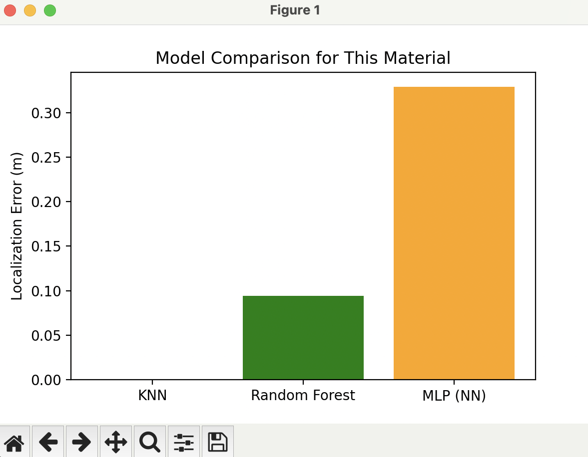
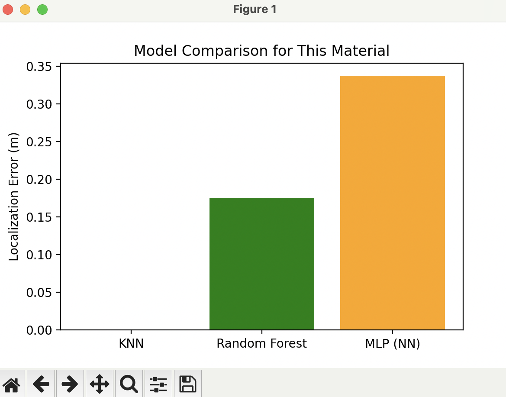
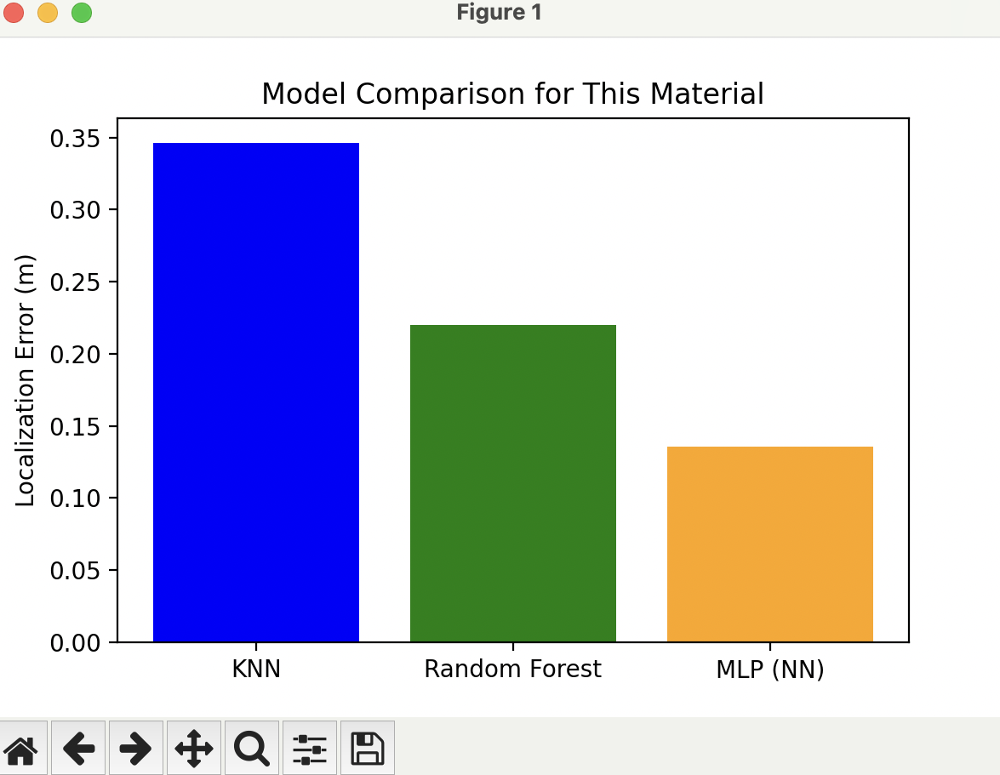
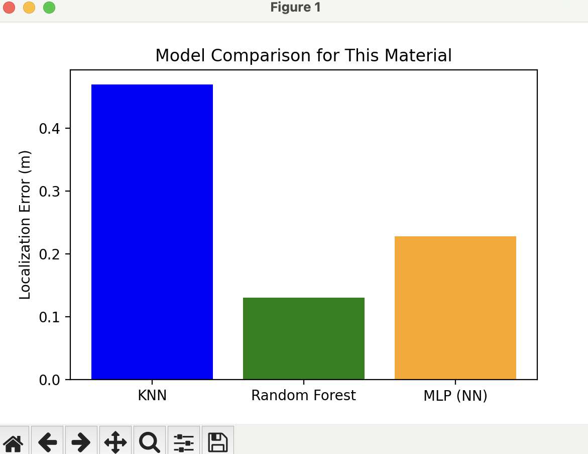
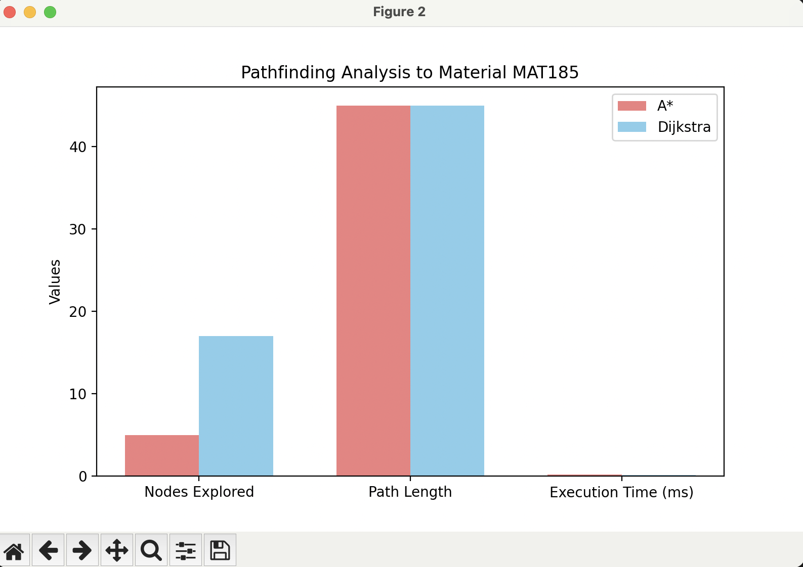

# **Analysis**

## Justification for choosing Wi-Fi

We selected Wi-Fi over BLE for this project based on practical considerations and power management strategies:

- **Lower Anchor Density :** Wi-Fi access points cover a larger area due to higher transmission power, reducing the number of edge gateway needed and simplifying deployment.  

- **Standardized Network :** Protocols and security settings are standardized across all collaborators, ensuring seamless interoperability in the industrial park.  

- **Power Management :** (to address Wi-Fi's higher energy use) 
  - Sleep Mode: Tags remain in deep sleep most of the time, minimizing power consumption.  
  - Short-Burst Transmission: Tags wake periodically or on motion, quickly send RSSI data, then return to sleep.  

- **Higher Data Throughput & Scalability :** Wi-Fi supports higher data rates and larger network capacity, allowing the system to scale to more tags or future data-intensive tasks without major infrastructure changes.  

This approach ensures efficient deployment, low average power usage, reliable tracking and long-term system scalability in an industrial environment.

 
## *Coarse Location (edge)*

We choose Max-RSSI because it's simply selects the gateway with the strongest RSSI for the given material from each edge gateway. The Centroid method takes the top 3 RSSI values and computes their average to estimate the coarse location. Max-RSSI and Centroid often produce the same result. Weighted Centroid performs poorly due to negative RSSI scaling, which reduces accuracy at the edge layer.

### *Example*,
True Position: [28  8]

Estimated Positions for a material:
 - Max-RSSI: [20 20]
 - Centroid: [20. 20.]
 - Weighted Centroid: [31.61841866 27.81107054]

 Errors: {'Max-RSSI': 14.422205101855956, 'Centroid': 14.422205101855956, 'Weighted Centroid': 20.138805066858755}
 

 ## *Exact Location (cloud)*
 
 We choose KNN because,
- In most cases, KNN predicts the exact location with 0.00 m error, making it highly reliable.
- Even when Random Forest or MLP is the “best model” the differences are very small, often just a few centimeters.
- KNN does not require traditional training. It uses stored data points and computes location based on nearest neighbors. This makes it simple for BLE-based indoor positioning.

#### **Sample 1**
KNN → [35.0, 92.0], Error: 0.00 m
Random Forest → [35.08, 91.95], Error: 0.09 m
MLP (NN) → [35.31, 92.1], Error: 0.33 m

 *Best Model*: KNN
Refined location: [35.0, 92.0]

---

#### **Sample 2**
KNN → [25.7, 24.36], Error: 0.47 m
Random Forest → [25.89, 24.07], Error: 0.13 m
MLP (NN) → [26.19, 23.87], Error: 0.23 m

 *Best Model*: Random Forest
Refined location: [25.89, 24.07]

---

#### **Sample 3**
KNN → [66.86, 61.68], Error: 0.35 m
Random Forest → [67.0, 62.22], Error: 0.22 m
MLP (NN) → [66.88, 62.06], Error: 0.14 m

 *Best Model*: MLP (NN)
Refined location: [66.88, 62.06]

---

---  
  
    
## *Path Finding*
In the pathfinding analysis, A* explores much fewer nodes than Dijkstra but still finds the same shortest path. This makes A* faster and more efficient because it uses a heuristic to focus on the best paths. Dijkstra checks many unnecessary nodes, so it takes more work even if the time difference is small. For indoor navigation from the user to materials, A* is the better choice.

#### **Sample 1**
A* Path       --> Nodes Explored: 7, Path Length: 64.47, Time: 0.17ms
Dijkstra Path --> Nodes Explored: 37, Path Length: 64.47, Time: 0.18ms

#### **Sample 2**
A* Path       -> Nodes Explored: 5, Path Length: 45.00, Time: 0.17ms
Dijkstra Path -> Nodes Explored: 17, Path Length: 45.00, Time: 0.13ms

#### **Sample 3**
A* Path       -> Nodes Explored: 20, Path Length: 75.39, Time: 0.21ms
Dijkstra Path -> Nodes Explored: 51, Path Length: 75.39, Time: 0.20ms
  
---
  

